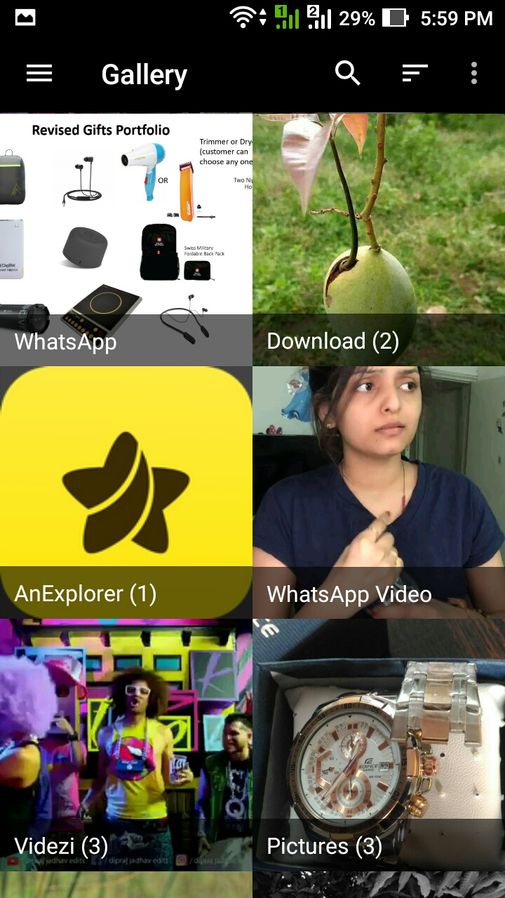

Consider Donating HoraApps -> 

# Gallery

Gallery is a fluid, material-designed alternative gallery forked from [LeadPic](https://github.com/HoraApps/LeafPic), it also is open source under GPLv3 license. It doesn't miss any of the main features of a stock gallery, and we also have plans to add more useful features. 
  

## Screenshots

#### Contributing

###### Code 
If you are a developer and you wish to contribute to the app please fork the project
and submit a pull request on the [dev branch](https://gitlab.com/TalaffuzApps/Gallery/tree/dev).

###### Issues
You can trace the status of known issues [here](https://gitlab.com/TalaffuzApps/Gallery/issues),
also feel free to file a new issue (helpful description, screenshots and logcat are appreciated), or send me an [email](mailto:talaffuz.apps@gmail.com) if you have any questions.

#### Licensing
Gallery is licensed under the [GNU v3 Public License](https://github.com/TalaffuzApps/Gallery/blob/dev/LICENSE).
In addition to the terms set by the GNU v3 Public License, we ask that if you use any code from this repository that you send us a message to let us know.
